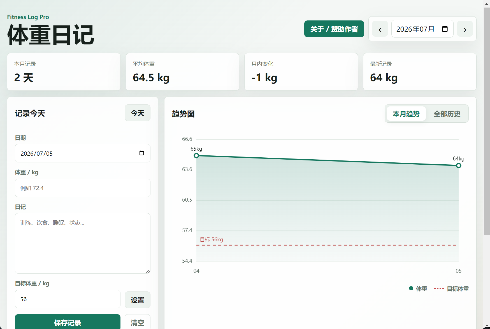

# 体重日记

一款永久免费、纯本地存储的体重记录软件。

《体重日记》用于记录每日体重、训练/饮食/睡眠日记、月度趋势、全部历史趋势和目标体重线。它不需要账号，不依赖云端服务器，也不会上传任何体重与健康数据。



## 官网

GitHub Pages：<https://airwaves520.github.io/weight-diary/>

## 下载

请到 GitHub Releases 下载最新版本：

- Windows 电脑版：`weight-diary-windows-x64.zip`
- Android 安卓版：`weight-diary-android-debug.apk`

## 功能

- 每日体重记录
- 训练、饮食、睡眠、状态日记
- 本月趋势图
- 全部历史趋势图
- 目标体重参考线
- CSV 数据导出
- JSON 备份导入/导出
- 自愿赞助入口
- 纯本地存储，不上传隐私数据

## 隐私说明

体重、日记、目标体重等数据默认保存在本机浏览器或 App 的本地存储中。软件没有账号系统，没有云端同步，也不会主动上传任何健康隐私数据。

如果你要换设备或重装软件，请先使用导出功能备份自己的数据。

## 项目结构

```text
src/web/          核心 Web 应用源码
docs/             GitHub Pages 官网
assets/           图标与截图
release-assets/   本地发布包，上传 Releases 用，不提交到 git
```

## 本地预览官网

直接打开：

```text
docs/index.html
```

## 发布方式

1. 推送本仓库到 GitHub：`Airwaves520/weight-diary`
2. 在仓库 Settings -> Pages 中启用 GitHub Pages
3. Source 选择 `Deploy from a branch`
4. Branch 选择 `main`，Folder 选择 `/docs`
5. 在 Releases 中上传 `release-assets` 里的 Windows 和 Android 安装包

## 赞助

软件会一直免费使用。

如果它刚好帮你省了一点时间、少走了一点弯路，或者在某个瞬间让你觉得“还挺好用”，那我就已经很开心了。

赞助不是购买功能，也不会影响任何使用权限，只是给这个小项目一点继续维护下去的动力。

## License

本项目当前以 MIT License 开源。
